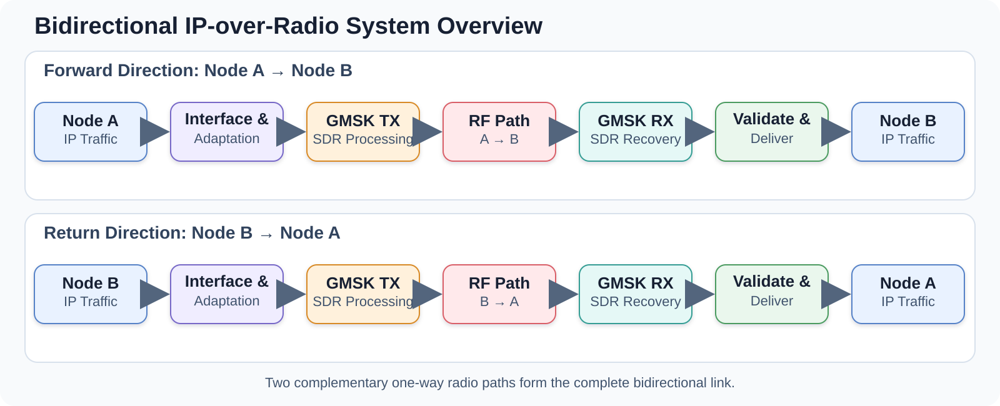
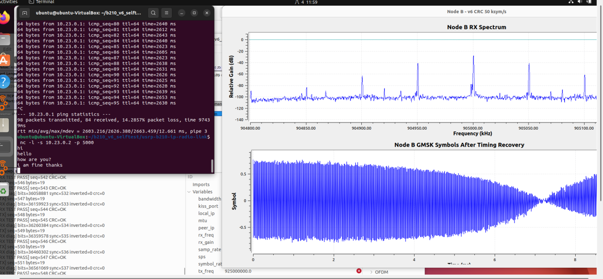
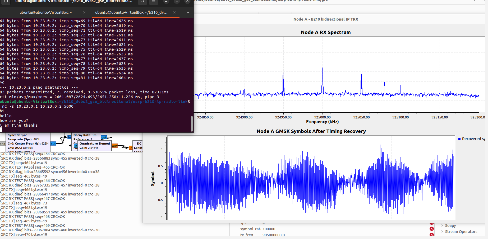

# USRP B210 Bidirectional IP Radio Link — Portfolio Edition

> **This repository is a public research portfolio. It presents the system architecture, engineering method, and experimental results, while core implementation code, complete flowgraphs, and deployable configurations are omitted.**

This repository presents the architecture, engineering process, and laboratory evidence for a bidirectional software-defined radio link built with two computers and two USRP B210 devices.

The project demonstrates that ordinary application traffic can be transported across a custom radio path while remaining visible to the host operating system as an IP link. The public repository is intentionally documentation-only: it explains what was built, how it was validated, and what was learned without publishing the complete deployable implementation or validated operating configuration.

## Project Objective

The goal was to integrate three normally separate domains into one working laboratory system:

- **Host networking:** ordinary IPv4 applications and a virtual point-to-point interface.
- **Link processing:** KISS-compatible local packet transport, framing, CRC-based integrity checks, and receive validation.
- **Software-defined radio:** GMSK modulation, synchronization, RF transmission, and reception through USRP B210 hardware.

The completed prototype supported communication in both directions. Each direction used an independent transmit and receive path so that request and return traffic could cross the radio link.

## High-Level Architecture



The design is described by layers rather than by deployment commands:

| Layer | Public description |
|---|---|
| Application and network | Standard host applications generate ordinary IP traffic. |
| Host-to-radio adaptation | A virtual interface bridges operating-system packets into the experimental link. |
| Link processing | KISS transport bridges local packets; frames are delimited, protected by CRC, and accepted only after validation. |
| Physical layer | GNU Radio and the USRP hardware perform GMSK modulation, transmission, synchronization, and recovery. |
| Bidirectional operation | Two complementary one-way RF paths form a complete request-and-return link. |

See [Architecture Overview](docs/ARCHITECTURE.md) for the conceptual packet path and engineering boundaries.

## Demonstrated Results

The laboratory demonstration verified:

- Bidirectional IPv4 ICMP communication.
- Interactive TCP text exchange.
- Repeated frame synchronization and integrity-valid reception.
- Simultaneous observation of terminal output, radio spectrum, and link behavior.

### Node B receiving from Node A



In the recorded run, 98 ICMP packets were transmitted and 84 were received. The observed packet loss was 14.2857%, with an average round-trip time of approximately 2.63 seconds.

### Node A receiving from Node B



In the recorded run, 83 ICMP packets were transmitted and 75 were received. The observed packet loss was 9.63855%, with an average round-trip time of approximately 2.62 seconds.

These figures document one controlled experiment and are not guaranteed performance specifications.

## Engineering Contribution

The main contribution was not a single modulation block. It was the end-to-end integration and verification of a cross-layer system:

1. Mapping host IP traffic into a radio-oriented data path.
2. Defining frame boundaries and integrity validation between the network and radio layers.
3. Building complementary transmit and receive processing chains.
4. Separating visible RF energy from successful synchronization, valid frame recovery, and actual host delivery.
5. Diagnosing faults layer by layer instead of treating every failure as an RF gain problem.
6. Demonstrating that both forward and return paths were required for bidirectional application traffic.

## Validation Method

Validation progressed from the lowest layer upward:

```text
RF energy observed
        -> symbol and frame acquisition
        -> integrity-valid payload recovery
        -> host-interface packet delivery
        -> one-way IP traffic
        -> bidirectional ICMP and TCP behavior
```

This staged method prevented a spectrum peak from being mistaken for a working digital link. A successful result required evidence at the RF, framing, operating-system, and application layers.

## Limitations and Future Work

The prototype remains a research demonstration:

- Measured latency and packet loss are substantial.
- The current link does not claim production-grade reliability, security, or interoperability.
- Performance varies with RF conditions, hardware scheduling, synchronization, and buffering.
- The recorded test does not establish guaranteed throughput or service quality.
- Future work includes forward-error correction, retransmission policy, latency reduction, adaptive operation, and broader repeatability testing.

See [Results and Limitations](docs/RESULTS_AND_LIMITATIONS.md) for a concise interpretation of the evidence.

## Public Repository Boundary

This repository is a **public portfolio and research-evidence edition**. To protect intellectual property and prevent the documentation from becoming a clone-to-deploy operating guide, it intentionally excludes:

- Core packet-framing, whitening, integrity, and local transport source code.
- Installation, startup, interface-attachment, and cleanup scripts.
- Complete GNU Radio Companion flowgraphs.
- Validated device, network, RF, gain, port, and interface configurations.
- Full unit-test and diagnostic utility implementations.
- Device identifiers, personal paths, credentials, and private experimental records.

The complete implementation and executable configuration are maintained separately. Additional technical material may be shared for academic review when appropriate.

## Documentation

- [Architecture Overview](docs/ARCHITECTURE.md)
- [Results and Limitations](docs/RESULTS_AND_LIMITATIONS.md)

## Responsible Use

All RF work must be conducted only with authorization and within applicable spectrum regulations. Laboratory validation should use a controlled environment, appropriate attenuation or shielding, and safe RF connection practices. This repository is documentation, not an authorization to transmit or interfere with communications.
