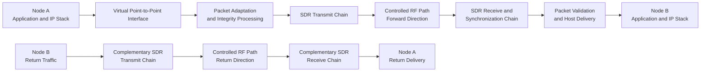

# Architecture Overview

## Purpose

The system demonstrates a bidirectional IP link over a controlled software-defined radio path. Applications at each endpoint use normal host networking. A local adaptation layer transfers packets into the radio chain, and the receiver returns only validated payloads to the remote host.

This public description intentionally explains responsibilities and evidence boundaries without publishing the complete implementation, operating parameters, or reproduction procedure.

## End-to-End Data Path



```text
Application
   -> host IP stack
   -> virtual point-to-point interface
   -> packet adaptation and frame integrity processing
   -> modulation and SDR transmit processing
   -> controlled RF channel
   -> SDR receive and synchronization processing
   -> frame validation and packet recovery
   -> remote host IP stack
   -> remote application
```

Bidirectional communication requires a second complementary path for acknowledgements and return traffic. A working forward receiver alone is therefore insufficient to demonstrate a complete link.

## Functional Layers

### Host networking

The host sees a point-to-point network path. Applications can generate ordinary IP traffic without needing to understand the radio implementation.

### Link adaptation

The adaptation layer uses a KISS-compatible local transport, establishes packet boundaries, carries diagnostic sequence information, and applies CRC-based integrity validation. Receive processing rejects incomplete or corrupted frames instead of injecting them into the host network.

### Software-defined radio processing

The transmit side converts framed data into a GMSK baseband waveform. The receive side performs signal conditioning, timing recovery, symbol decisions, frame acquisition, and payload reconstruction.

### Bidirectional operation

Two independent one-way paths form the complete system. This separation helps diagnose direction-specific problems and supports simultaneous request-and-return traffic in the laboratory.

## Evidence Model

The project distinguishes four different levels of evidence:

| Evidence | What it proves |
|---|---|
| Visible RF energy | A signal reached the receiver bandwidth. |
| Frame acquisition | Receive synchronization found a plausible data structure. |
| Integrity-valid payload | A complete frame survived recovery and validation. |
| Host/application delivery | The recovered packet reached the network stack and produced observable traffic. |

The final demonstration required all four levels in both directions.

## Public/Private Boundary

The portfolio edition publishes the conceptual architecture, measured outcomes, limitations, and screenshots. Exact frame layouts, implementation source, executable flowgraphs, deployment scripts, and validated operating settings remain outside the public repository.
